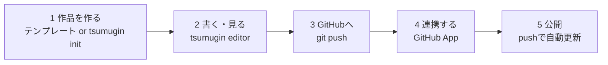

# つむぎん 作品テンプレート

[つむぎん](https://tsumugin.com) で物語を書いて公開するための作品リポジトリのテンプレートです。**GitHub に push するだけで公開されます。** 所要時間は 30 分ほどです。

- 規約に沿った雛形（`story.yaml` / `episodes/` / `characters/` / `world/` / `assets/`）
- AI エージェント向けの執筆ガイド [AGENTS.md](./AGENTS.md)（Claude Code は `CLAUDE.md` 経由で自動で読みます）



## 必要なもの

- Node.js 20 以上
- GitHub アカウント
- 文章を書く AI エージェント（Claude Code など。任意）

## 1. 作品リポジトリを作る

どちらかの方法で作ります。

**A. このテンプレートから作る**

1. 右上の **Use this template → Create a new repository** を押す（リポジトリは private でも構いません）
2. 作ったリポジトリを clone して、`story.yaml` の `title` と `summary` を自分の作品に書き換える

```sh
git clone <作ったリポジトリのURL> my-story
cd my-story
```

**B. CLI で作る**

```sh
npx tsumugin@latest init my-story --title "はじめての物語"
cd my-story
```

どちらも同じ構成になります。

```
my-story/
├── story.yaml            # 作品のタイトル・あらすじ・タグ
├── episodes/
│   └── 001-prologue.md   # 第1話（下書き）
├── characters/           # キャラクター設定
├── world/                # 世界観・用語集
├── assets/               # 表紙・挿絵
├── AGENTS.md             # AI エージェント向けの執筆ガイド
└── CLAUDE.md             # Claude Code 用（AGENTS.md を読み込むだけ）
```

## 2. エディタで書いて、読んでみる

```sh
npx tsumugin@latest editor
```

ブラウザが開き、**読むモード**で作品が表示されます。書きたくなったら右上の「編集する」を押してください。

- 左のサイドバーで話・設定資料を切り替え
- 「横書き / 縦書き」「文字± 」で読み心地を調整
- 編集内容は ⌘S（Ctrl+S）で保存。**保存先はリポジトリ内の `.md` ファイルそのもの**です

### AI に書かせる

エディタを起動したまま、別のターミナルで AI エージェントに書かせてください。規約は [AGENTS.md](./AGENTS.md) にまとまっているので、AI はそれを読んで公開できる形で書きます。

```sh
claude "episodes/001-prologue.md に、夜の図書館に迷い込む少女のプロローグを書いて"
```

**AI がファイルを書き換えると、開いているエディタとプレビューが自動で追従します。** あなたは最初の読者として、縦書きで読みながら続けるかを判断できます。

### 話を増やす

```sh
npx tsumugin@latest new --slug first-night --title "最初の夜"
```

次の話番号が自動で振られます。

### 記法

| 書きたいもの | 書き方 | 表示 |
| --- | --- | --- |
| ルビ | `\|紅玉《ルビー》` | 紅玉（ルビー） |
| ルビ（漢字のみ） | `月影《つきかげ》` | 月影（つきかげ） |
| 傍点 | `《《ぞわり》》` | ぞわり（傍点つき） |
| 挿絵 | `` | 画像 |
| 縦中横 | 自動（`12月`・`!?` など） | 縦書き時に横並び |

表紙は `assets/` に置き、`story.yaml` の `cover:` で指定します。挿絵・表紙は画像生成 AI で作ったものをそのまま置けます（容量が大きい PNG は JPEG / WebP に変換するのがおすすめです）。

### 公開の準備

書けたら、話の先頭（frontmatter）を `published: true` にします。

```markdown
---
title: 夜だけひらく扉
published: true
---
```

- `published: false` の話は下書きのまま、公開されません
- `publish_at: 2026-09-01T20:00:00+09:00` を足すと**予約公開**になります

投稿前に規約チェックをしておくと安心です。

```sh
npx tsumugin@latest validate
```

## 3. GitHub に置く

テンプレートから作った場合はすでに GitHub 上にあるので、commit して push するだけです。

```sh
git add -A && git commit -m "Write the first episode" && git push
```

CLI で作った場合はリポジトリを作って push します（private でも構いません）。

```sh
git init && git add -A && git commit -m "Add my story"
gh repo create my-story --private --source . --push
```

## 4. つむぎんと連携する

1. [https://tsumugin.com/signin](https://tsumugin.com/signin) から **GitHub でログイン**します
2. ダッシュボードの案内から **GitHub App をインストール**します（インストール先で**対象のリポジトリだけを選ぶ**ことをおすすめします）
3. インストール後、ダッシュボードに戻るのでリポジトリの**連携を ON** にします（対象ブランチは未指定ならデフォルトブランチ）

連携の解除もダッシュボードからいつでも行えます（解除すると作品は非公開になります）。

## 5. 公開される

連携後、対象ブランチ（既定ブランチ）に push すると自動でビルドされます。連携直後は空コミットでもよいので一度 push してください。

```sh
git push
```

- コミットに **`tsumugin/build` のステータス**が付きます
  - 成功: 「公開しました（公開中 2話 / 全3話）」
  - 失敗: どのファイルの何が規約違反かが表示されます
- 数十秒で `https://tsumugin.com/works/<作品スラッグ>` に反映されます
- ビルドの結果（成否・失敗理由）は[ダッシュボード](https://tsumugin.com/dashboard)でも確認できます

以降は、**書いて push するだけ**で連載が更新されます。

## つまずいたら

| 症状 | 確認すること |
| --- | --- |
| `tsumugin editor` が「作品リポジトリではありません」と言う | `story.yaml` があるディレクトリで実行しているか |
| ビルドが失敗する | `npx tsumugin@latest validate` をローカルで実行してエラー内容を確認 |
| 話が公開されない | frontmatter が `published: true` か、`publish_at` が未来になっていないか |
| 挿絵が出ない | 本文からの相対パスが合っているか（`validate` が検出します） |
| 作品ページが 404 | ビルドが成功しているか（コミットのステータスを確認） |

解決しない場合は、このリポジトリの [Issues](https://github.com/hampen2929/tsumugin-story-template/issues) までお知らせください。

## 1つのリポジトリに複数の作品を置く

短編をいくつも書く場合、リポジトリを分けなくてもかまいません。サブディレクトリごとに `story.yaml` を置けば、それぞれが独立した作品として公開されます。

```
my-stories/
├── yoru-no-toshokan/
│   ├── story.yaml       # slug: yoru  ← 公開URLを指定できる
│   └── episodes/
└── nemuri-no-eki/
    ├── story.yaml
    └── episodes/
```

エディタは作品セレクタで切り替えられ、`tsumugin new --story yoru-no-toshokan` のように作品を指定して話を追加できます。

詳しい規約は [AGENTS.md](./AGENTS.md) にまとめています。

## このテンプレートのライセンス

このリポジトリに含まれる**雛形（`story.yaml` / `episodes/` / `characters/` / `world/` の見本、`AGENTS.md`、本 README）は [CC0 1.0](./LICENSE)** で提供します。著作権表示もクレジットも不要で、自由にコピー・改変して使えます。

**あなたが書いた物語の権利はあなたのものです。** このテンプレートを使ったこと自体は、作品に何のライセンス上の制約も加えません。作品にライセンスを付けたい場合は、あなたのリポジトリの `LICENSE` を自分の意図するものに置き換えてください（何も付けなければ通常の著作権のまま、全権利があなたに留保されます）。
